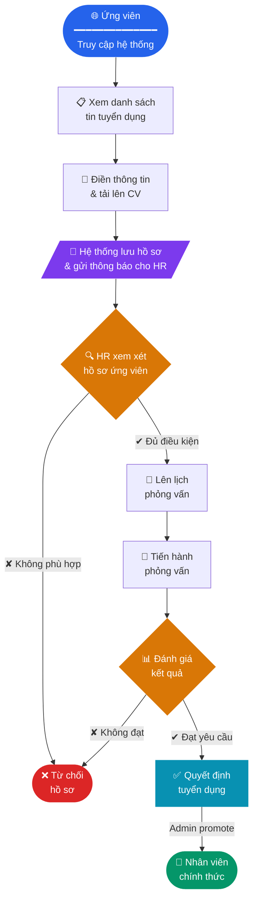

<div align="center">

# Hệ Thống Quản Lý Tuyển Dụng Nhân Sự

**Recruitment Management System** — Ứng dụng web quản lý toàn chu trình tuyển dụng, từ đăng tin đến tuyển dụng chính thức.

[](https://www.php.net)
[](https://laravel.com)
[](https://tailwindcss.com)
[](https://vitejs.dev)
[](https://phpunit.de)
[](LICENSE)

</div>

---

## Mục lục

- [Tổng quan](#tổng-quan)
- [Tính năng](#tính-năng)
- [Công nghệ sử dụng](#công-nghệ-sử-dụng)
- [Yêu cầu hệ thống](#yêu-cầu-hệ-thống)
- [Cài đặt](#cài-đặt)
- [Cấu hình môi trường](#cấu-hình-môi-trường)
- [Khởi động](#khởi-động)
- [Phân quyền & Route](#phân-quyền--route)
- [Cấu trúc dự án](#cấu-trúc-dự-án)
- [Testing](#testing)

---

## Tổng quan

Hệ thống được xây dựng nhằm số hóa và tự động hóa quy trình tuyển dụng của doanh nghiệp. Ứng viên có thể tự ứng tuyển trực tuyến; bộ phận nhân sự (HR) quản lý toàn bộ vòng đời hồ sơ — từ tiếp nhận, phân loại, lên lịch phỏng vấn, đến ra quyết định tuyển dụng và chuyển đổi thành nhân viên.

**Luồng nghiệp vụ chính:**



---

## Tính năng

### Dành cho Ứng viên *(không cần đăng nhập)*

| Tính năng | Mô tả |
|---|---|
| Xem tin tuyển dụng | Danh sách vị trí đang mở, lọc theo đợt tuyển dụng, phân trang |
| Xem chi tiết vị trí | Mô tả công việc, yêu cầu, mức lương, hạn nộp hồ sơ |
| Nộp hồ sơ trực tuyến | Upload CV (PDF/DOC/DOCX, tối đa 5MB) kèm thông tin cá nhân |
| Theo dõi trạng thái | Tra cứu trạng thái hồ sơ sau khi đăng nhập |

### Dành cho Admin *(toàn quyền)*

| Tính năng | Mô tả |
|---|---|
| Dashboard | Thống kê tổng quan: số ứng viên, vị trí mở, phỏng vấn sắp tới |
| Quản lý đợt tuyển dụng | CRUD Recruitment Periods (mở/đóng theo thời gian) |
| Quản lý tin tuyển dụng | CRUD Job Postings, kích hoạt/ẩn, gán vào đợt tuyển dụng |
| Quản lý ứng viên | Xem hồ sơ, download CV, cập nhật trạng thái, xóa |
| Lịch phỏng vấn | Tạo/cập nhật/hủy lịch phỏng vấn cho từng ứng viên |
| Tuyển dụng & thăng chức | Chuyển ứng viên thành nhân viên chính thức |
| Quản lý nhân viên | CRUD hồ sơ nhân viên, phân phòng ban, quản lý file (avatar, CV, hợp đồng) |
| Thông báo real-time | Nhận push notification khi có hồ sơ mới |

### Dành cho Staff *(HR nội bộ)*

| Tính năng | Ghi chú |
|---|---|
| Dashboard & danh sách nhân viên | Xem, không chỉnh sửa cơ cấu |
| Quản lý tin tuyển dụng | Tạo/sửa Job Postings |
| Xem & cập nhật ứng viên | Không thể xóa ứng viên |
| Quản lý lịch phỏng vấn | Tạo/sửa/hủy Interview |
| Thông báo | Nhận và đọc thông báo hệ thống |

---

## Công nghệ sử dụng

| Layer | Thư viện / Công cụ | Phiên bản |
|---|---|---|
| **Backend** | PHP / Laravel Framework | 8.3+ / 13.x |
| **ORM** | Eloquent ORM | Laravel built-in |
| **Frontend** | Blade + Tailwind CSS + Vite | 4.x / 8.x |
| **Database** | SQLite (dev) · MySQL (prod) | — / 8.0+ |
| **Queue** | Laravel Queue — Database driver | — |
| **Notification** | Laravel Notifications (DB channel) | — |
| **Testing** | PHPUnit | 12.x |
| **Code Style** | Laravel Pint (PSR-12) | 1.x |
| **Dev Tools** | Laravel Pail (log viewer), Concurrently | — |

---

## Yêu cầu hệ thống

| Dependency | Phiên bản tối thiểu |
|---|---|
| PHP | **8.3** |
| Composer | **2.x** |
| Node.js | **18.x** |
| npm | **9.x** |
| SQLite | **3.x** *(hoặc MySQL 8.0+)* |

---

## Cài đặt

### Cách 1 — Setup tự động *(khuyến nghị)*

```bash
git clone <repository-url> ktpm && cd ktpm
composer setup
```

Script `composer setup` sẽ tự động thực hiện toàn bộ:
`composer install` → copy `.env` → `key:generate` → `migrate` → `npm install` → `npm run build`

---

### Cách 2 — Cài đặt thủ công

```bash
# Clone
git clone <repository-url> ktpm
cd ktpm

# PHP dependencies
composer install

# Môi trường
cp .env.example .env
php artisan key:generate

# Database
touch database/database.sqlite   # chỉ cần nếu dùng SQLite
php artisan migrate

# Storage symlink (để serve file upload)
php artisan storage:link

# Frontend
npm install
npm run build
```

---

## Cấu hình môi trường

Sao chép `.env.example` thành `.env` và điều chỉnh các biến sau:

```dotenv
APP_NAME="Hệ Thống Tuyển Dụng"
APP_URL=http://localhost

# ── Database ─────────────────────────────────
DB_CONNECTION=sqlite
# Nếu dùng MySQL, comment dòng trên và bỏ comment các dòng sau:
# DB_CONNECTION=mysql
# DB_HOST=127.0.0.1
# DB_PORT=3306
# DB_DATABASE=ktpm_db
# DB_USERNAME=root
# DB_PASSWORD=secret

# ── Mail ─────────────────────────────────────
# Dùng "log" để debug không cần SMTP thật
MAIL_MAILER=log
# Khi production, chuyển sang smtp và điền thông tin thật:
# MAIL_MAILER=smtp
# MAIL_HOST=smtp.example.com
# MAIL_PORT=587
# MAIL_USERNAME=...
# MAIL_PASSWORD=...
# MAIL_FROM_ADDRESS=no-reply@example.com
```

### Tạo tài khoản Admin đầu tiên

```bash
# Đăng ký tài khoản qua /register, sau đó chạy lệnh sau:
php artisan tinker --execute="App\Models\User::where('email','your@email.com')->update(['role'=>'admin']);"
```

---

## Khởi động

### Development

```bash
composer dev
```

Lệnh này chạy song song 4 process qua `concurrently`:

| Process | Mô tả | URL |
|---|---|---|
| `php artisan serve` | PHP built-in web server | `http://localhost:8000` |
| `php artisan queue:listen` | Queue worker (retry: 1) | — |
| `php artisan pail` | Real-time log viewer | — |
| `npm run dev` | Vite HMR dev server | `http://localhost:5173` |

### Production

```bash
npm run build
php artisan optimize
php artisan serve   # hoặc cấu hình Nginx/Apache
```

### Testing

```bash
composer test
# hoặc
php artisan test --coverage
```

---

## Phân quyền & Route

### Phân quyền

| Role | Mô tả |
|---|---|
| `admin` | Toàn quyền hệ thống. Có thể tuyển dụng, thăng chức, xóa dữ liệu nhạy cảm. |
| `staff` | HR nội bộ. Quản lý tuyển dụng và ứng viên nhưng không có quyền xóa hoặc promote. |
| `user` | Ứng viên bên ngoài. Chỉ xem tin và nộp hồ sơ. |

### Bảng Route chính

| Method | URI | Middleware | Controller | Mô tả |
|---|---|---|---|---|
| `GET` | `/` | — | Closure | Trang chủ |
| `GET` | `/jobs` | — | Closure | Danh sách tin tuyển dụng |
| `GET` | `/jobs/{id}` | — | Closure | Chi tiết vị trí |
| `POST` | `/apply` | — | Closure | Nộp hồ sơ ứng tuyển |
| `GET` | `/login` | — | AuthController | Form đăng nhập |
| `POST` | `/login` | — | AuthController | Xử lý đăng nhập |
| `GET` | `/register` | — | AuthController | Form đăng ký |
| `GET` | `/dashboard` | auth, role:admin,staff | DashboardController | Dashboard |
| `GET` | `/staff` | auth, role:admin,staff | StaffController | Danh sách nhân viên |
| `POST` | `/staff` | auth, role:admin,staff | StaffController | Thêm nhân viên |
| `PUT` | `/staff/{id}` | auth, role:admin,staff | StaffController | Cập nhật nhân viên |
| `DELETE` | `/staff/{id}` | auth, role:admin,staff | StaffController | Xóa nhân viên |
| `GET` | `/hiring-promotions` | auth, role:admin | HiringController | Trang tuyển dụng |
| `POST` | `/hiring-promotions/{id}/promote` | auth, role:admin | HiringController | Thăng chức ứng viên |
| `GET` | `/recruitment` | auth, role:admin,staff | RecruitmentController | Dashboard tuyển dụng |
| `POST` | `/recruitment/period` | auth, role:admin | RecruitmentController | Tạo đợt tuyển dụng |
| `POST` | `/recruitment/job` | auth, role:admin,staff | RecruitmentController | Đăng tin tuyển dụng |
| `POST` | `/recruitment/interview` | auth, role:admin,staff | RecruitmentController | Tạo lịch phỏng vấn |

---

## Cấu trúc dự án

```
ktpm/
├── app/
│   ├── Http/
│   │   ├── Controllers/
│   │   │   ├── AuthController.php              # Login / Register / Reset password
│   │   │   ├── NotificationController.php      # CRUD thông báo người dùng
│   │   │   └── admin/
│   │   │       ├── DashboardController.php     # Thống kê & dashboard
│   │   │       ├── HiringController.php        # Tuyển dụng & thăng chức
│   │   │       ├── RecruitmentController.php   # Toàn bộ nghiệp vụ tuyển dụng
│   │   │       └── StaffController.php         # Quản lý nhân viên & file
│   │   └── Middleware/
│   ├── Models/
│   │   ├── User.php                            # Người dùng hệ thống
│   │   ├── Employee.php                        # Hồ sơ nhân viên (education, experience…)
│   │   ├── Department.php                      # Phòng ban & trưởng phòng
│   │   ├── JobPosting.php                      # Tin tuyển dụng (auto-ID: JOB_0001)
│   │   ├── RecruitmentPeriod.php               # Đợt tuyển dụng (open/closed)
│   │   ├── Candidate.php                       # Hồ sơ ứng viên
│   │   └── Interview.php                       # Lịch phỏng vấn
│   ├── Notifications/
│   │   └── NewCandidateApplicationNotification.php
│   ├── Observers/                              # Eloquent Model Observers
│   └── Support/
│       └── CandidateBackup.php                 # Backup JSON hồ sơ ứng viên
├── database/
│   ├── migrations/                             # 13 migration files (chronological)
│   ├── factories/
│   └── seeders/
├── resources/
│   ├── css/
│   └── views/                                  # Blade templates
├── routes/
│   └── web.php                                 # Tất cả routes
├── storage/
│   └── app/public/candidates/                  # CV đã upload (served qua symlink)
├── tests/
├── .env.example
├── composer.json                               # composer setup | dev | test
├── package.json
└── vite.config.js
```

---

## Testing

```bash
# Chạy toàn bộ test suite
composer test

# Chạy với coverage report
php artisan test --coverage

# Chạy một test cụ thể
php artisan test --filter=ExampleTest
```

Test files nằm trong thư mục `tests/` theo chuẩn PHPUnit 12 + Laravel test helpers.


<div align="center">

Được xây dựng cho môn học **Kỹ Thuật Phần Mềm** &nbsp;·&nbsp; PHP 8.3 + Laravel 13

</div>