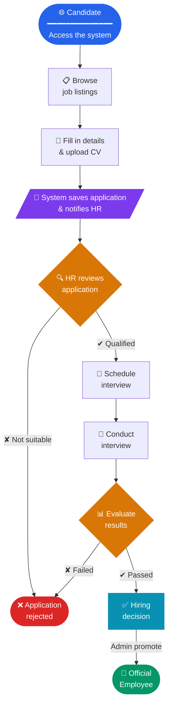

<div align="center">

# Recruitment Management System

**Web application for managing the full recruitment lifecycle — from job postings to official hiring.**

[](https://www.php.net)
[](https://laravel.com)
[](https://tailwindcss.com)
[](https://vitejs.dev)
[](https://phpunit.de)
[](LICENSE)

🌐 **Ngôn ngữ / Language:** 🇬🇧 English &nbsp;|&nbsp; 🇻🇳 [Tiếng Việt](README.vi.md)

</div>

---

## Table of Contents

- [Overview](#overview)
- [Features](#features)
- [Tech Stack](#tech-stack)
- [System Requirements](#system-requirements)
- [Installation](#installation)
- [Environment Configuration](#environment-configuration)
- [Running the App](#running-the-app)
- [Roles & Routes](#roles--routes)
- [Project Structure](#project-structure)
- [Testing](#testing)

---

## Overview

The system is built to digitize and automate the enterprise recruitment process. Candidates can apply online by themselves; the HR department manages the entire applicant lifecycle — from receiving and screening applications, scheduling interviews, making hiring decisions, and converting candidates into official employees.

**Main business flow:**



---

## Features

### For Candidates *(no login required)*

| Feature | Description |
|---|---|
| Browse job listings | List of open positions, filterable by recruitment period, with pagination |
| View position details | Job description, requirements, salary range, application deadline |
| Apply online | Upload CV (PDF/DOC/DOCX, max 5 MB) along with personal information |
| Track application status | Check application status after logging in |

### For Admin *(full access)*

| Feature | Description |
|---|---|
| Dashboard | Overview statistics: number of applicants, open positions, upcoming interviews |
| Manage recruitment periods | CRUD Recruitment Periods (open/close by time window) |
| Manage job postings | CRUD Job Postings, activate/hide, assign to recruitment period |
| Manage candidates | View profiles, download CV, update status, delete |
| Interview scheduling | Create/update/cancel interview schedules per candidate |
| Hiring & promotion | Convert candidates into official employees |
| Employee management | CRUD employee profiles, assign departments, manage files (avatar, CV, contract) |
| Real-time notifications | Receive push notifications when a new application is submitted |

### For Staff *(internal HR)*

| Feature | Notes |
|---|---|
| Dashboard & employee list | View only — cannot edit org structure |
| Manage job postings | Create/edit Job Postings |
| View & update candidates | Cannot delete candidates |
| Manage interview schedules | Create/edit/cancel interviews |
| Notifications | Receive and read system notifications |

---

## Tech Stack

| Layer | Library / Tool | Version |
|---|---|---|
| **Backend** | PHP / Laravel Framework | 8.3+ / 13.x |
| **ORM** | Eloquent ORM | Laravel built-in |
| **Frontend** | Blade + Tailwind CSS + Vite | 4.x / 8.x |
| **Database** | SQLite (dev) · MySQL (prod) | — / 8.0+ |
| **Queue** | Laravel Queue — Database driver | — |
| **Notification** | Laravel Notifications (DB channel) | — |
| **Testing** | PHPUnit | 12.x |
| **Code Style** | Laravel Pint (PSR-12) | 1.x |
| **Dev Tools** | Laravel Pail (log viewer), Concurrently | — |

---

## System Requirements

| Dependency | Minimum Version |
|---|---|
| PHP | **8.3** |
| Composer | **2.x** |
| Node.js | **18.x** |
| npm | **9.x** |
| SQLite | **3.x** *(or MySQL 8.0+)* |

---

## Installation

### Option 1 — Automated setup *(recommended)*

```bash
git clone <repository-url> ktpm && cd ktpm
composer setup
```

The `composer setup` script runs everything automatically:
`composer install` → copy `.env` → `key:generate` → `migrate` → `npm install` → `npm run build`

---

### Option 2 — Manual setup

```bash
# Clone
git clone <repository-url> ktpm
cd ktpm

# PHP dependencies
composer install

# Environment
cp .env.example .env
php artisan key:generate

# Database
touch database/database.sqlite   # only needed for SQLite
php artisan migrate

# Storage symlink (to serve uploaded files)
php artisan storage:link

# Frontend
npm install
npm run build
```

---

## Environment Configuration

Copy `.env.example` to `.env` and adjust the following variables:

```dotenv
APP_NAME="Recruitment System"
APP_URL=http://localhost

# ── Database ─────────────────────────────────
DB_CONNECTION=sqlite
# To use MySQL, comment the line above and uncomment the lines below:
# DB_CONNECTION=mysql
# DB_HOST=127.0.0.1
# DB_PORT=3306
# DB_DATABASE=ktpm_db
# DB_USERNAME=root
# DB_PASSWORD=secret

# ── Mail ─────────────────────────────────────
# Use "log" to debug without a real SMTP server
MAIL_MAILER=log
# For production, switch to smtp and fill in real credentials:
# MAIL_MAILER=smtp
# MAIL_HOST=smtp.example.com
# MAIL_PORT=587
# MAIL_USERNAME=...
# MAIL_PASSWORD=...
# MAIL_FROM_ADDRESS=no-reply@example.com
```

### Creating the first Admin account

```bash
# Register an account via /register, then run:
php artisan tinker --execute="App\Models\User::where('email','your@email.com')->update(['role'=>'admin']);"
```

---

## Running the App

### Development

```bash
composer dev
```

This runs 4 processes in parallel via `concurrently`:

| Process | Description | URL |
|---|---|---|
| `php artisan serve` | PHP built-in web server | `http://localhost:8000` |
| `php artisan queue:listen` | Queue worker (retry: 1) | — |
| `php artisan pail` | Real-time log viewer | — |
| `npm run dev` | Vite HMR dev server | `http://localhost:5173` |

### Production

```bash
npm run build
php artisan optimize
php artisan serve   # or configure Nginx/Apache
```

### Testing

```bash
composer test
# or
php artisan test --coverage
```

---

## Roles & Routes

### Roles

| Role | Description |
|---|---|
| `admin` | Full system access. Can hire, promote, and delete sensitive data. |
| `staff` | Internal HR. Manages recruitment and candidates but cannot delete or promote. |
| `user` | External candidate. Can only browse listings and submit applications. |

### Main Route Table

| Method | URI | Middleware | Controller | Description |
|---|---|---|---|---|
| `GET` | `/` | — | Closure | Home page |
| `GET` | `/jobs` | — | Closure | Job listings |
| `GET` | `/jobs/{id}` | — | Closure | Job detail |
| `POST` | `/apply` | — | Closure | Submit application |
| `GET` | `/login` | — | AuthController | Login form |
| `POST` | `/login` | — | AuthController | Handle login |
| `GET` | `/register` | — | AuthController | Registration form |
| `GET` | `/dashboard` | auth, role:admin,staff | DashboardController | Dashboard |
| `GET` | `/staff` | auth, role:admin,staff | StaffController | Employee list |
| `POST` | `/staff` | auth, role:admin,staff | StaffController | Add employee |
| `PUT` | `/staff/{id}` | auth, role:admin,staff | StaffController | Update employee |
| `DELETE` | `/staff/{id}` | auth, role:admin,staff | StaffController | Delete employee |
| `GET` | `/hiring-promotions` | auth, role:admin | HiringController | Hiring page |
| `POST` | `/hiring-promotions/{id}/promote` | auth, role:admin | HiringController | Promote candidate |
| `GET` | `/recruitment` | auth, role:admin,staff | RecruitmentController | Recruitment dashboard |
| `POST` | `/recruitment/period` | auth, role:admin | RecruitmentController | Create recruitment period |
| `POST` | `/recruitment/job` | auth, role:admin,staff | RecruitmentController | Post a job |
| `POST` | `/recruitment/interview` | auth, role:admin,staff | RecruitmentController | Schedule interview |

---

## Project Structure

```
ktpm/
├── app/
│   ├── Http/
│   │   ├── Controllers/
│   │   │   ├── AuthController.php              # Login / Register / Reset password
│   │   │   ├── NotificationController.php      # User notification CRUD
│   │   │   └── admin/
│   │   │       ├── DashboardController.php     # Statistics & dashboard
│   │   │       ├── HiringController.php        # Hiring & promotion
│   │   │       ├── RecruitmentController.php   # Full recruitment business logic
│   │   │       └── StaffController.php         # Employee management & files
│   │   └── Middleware/
│   ├── Models/
│   │   ├── User.php                            # System users
│   │   ├── Employee.php                        # Employee profile (education, experience…)
│   │   ├── Department.php                      # Departments & department heads
│   │   ├── JobPosting.php                      # Job postings (auto-ID: JOB_0001)
│   │   ├── RecruitmentPeriod.php               # Recruitment periods (open/closed)
│   │   ├── Candidate.php                       # Applicant profiles
│   │   └── Interview.php                       # Interview schedules
│   ├── Notifications/
│   │   └── NewCandidateApplicationNotification.php
│   ├── Observers/                              # Eloquent Model Observers
│   └── Support/
│       └── CandidateBackup.php                 # JSON backup of candidate profiles
├── database/
│   ├── migrations/                             # 13 migration files (chronological)
│   ├── factories/
│   └── seeders/
├── resources/
│   ├── css/
│   └── views/                                  # Blade templates
├── routes/
│   └── web.php                                 # All routes
├── storage/
│   └── app/public/candidates/                  # Uploaded CVs (served via symlink)
├── tests/
├── .env.example
├── composer.json                               # composer setup | dev | test
├── package.json
└── vite.config.js
```

---

## Testing

```bash
# Run the full test suite
composer test

# Run with coverage report
php artisan test --coverage

# Run a specific test
php artisan test --filter=ExampleTest
```

Test files live in the `tests/` directory following PHPUnit 12 + Laravel test helper conventions.

<div align="center">

Built for the **Software Engineering** course &nbsp;·&nbsp; PHP 8.3 + Laravel 13

</div>